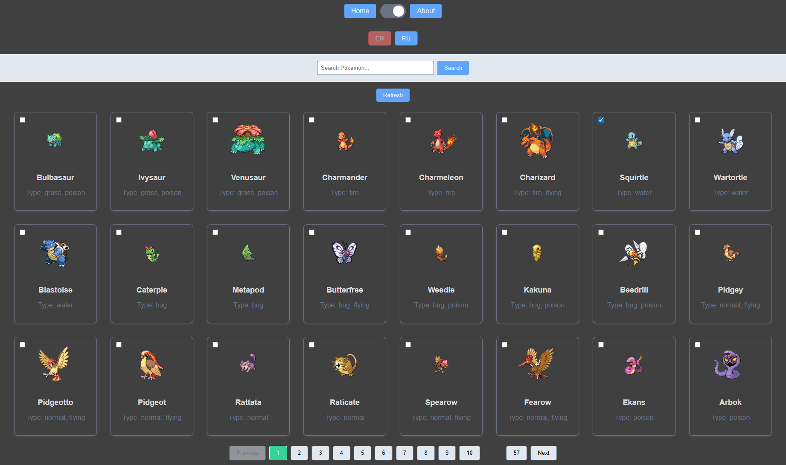

# Pokemon App

**Pokemon App** — an educational React project demonstrating the evolution of a web application from class components to Next.js with Server-Side Rendering.

## 🌐 Live Demo
* [Netlify](https://squallerq-class-components.netlify.app/)

## 🖥️ Screenshot

## Project Evolution

This project was developed step-by-step, with each stage in a separate branch:

1. **`class-components`** — Initial version built with React class components
2. **`unit-testing`** — Added unit testing with Vitest
3. **`hooks-and-routing`** — Migrated to React Hooks and added routing
4. **`app-state-management`** — Implemented state management
5. **`api-queries`** — Integrated API queries for fetching Pokemon data
6. **`main`** — Final version with Next.js and Server-Side Rendering ✨ (merged from `nextjs-ssr` branch)

## Features

- Server-Side Rendering (SSR) with Next.js
- Unit testing with Vitest
- Dark/Light theme toggle
- Internationalization (i18n) with multi-language support
- Modern React Hooks architecture
- API integration for Pokemon data
- Responsive design

## Tech Stack

- Next.js
- React
- TypeScript
- Vitest
- i18next

## Run Locally

1. Clone the repo: `git clone https://github.com/SquallerQ/pokemon-app.git`
2. Navigate to the project directory: `cd pokemon-app`
3. Install dependencies: `npm install`
4. Start development server: `npm run dev`
5. Open [http://localhost:3000](http://localhost:3000) in your browser

## 📚 Related

This project is part of the Rolling Scopes School React course. Additional assignments (forms, optimization) can be found in the [react-rss-projects](https://github.com/SquallerQ/react-rss-projects) repository.